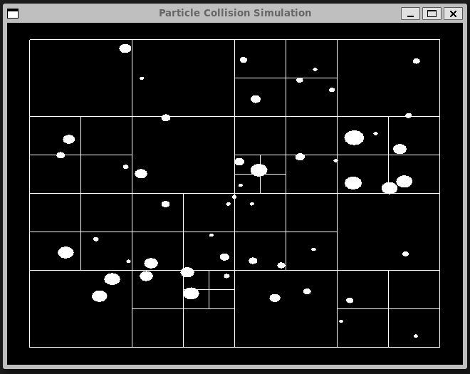
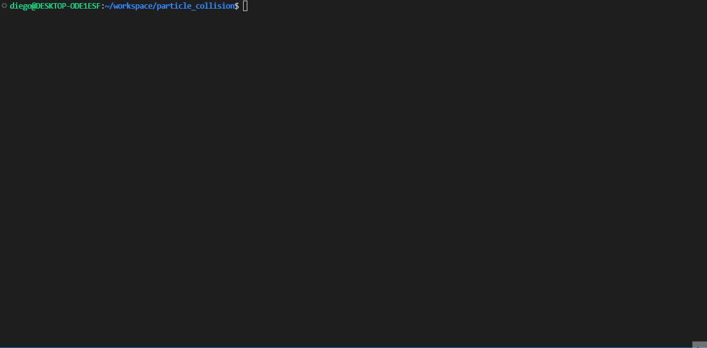

# Particle Collision Physics

This project exemplifies how to use cmake to build your code together with conan to manage your dependencies. The project in itself uses OpenGL to render particles collinding with each other in a predefined box.

The code renders the position of the particles advancing. In the background, the `Quad Tree` used in the tracking of particles is displayed. The quad tree has a capacity of two. No more than 2 objects will be located within a tree node.

Please note the physics and rendering are two separate `threads` of execution as they have considerably different refresh rates.





### Build Guide

The `build.sh` script contains the set of instruction to compile the code. There are a few calls to the apt-get package manager to install all required dependencies. You may be prompt to enter your sudo password should you want to install those. In a future release, this is expected to be handled via docker image.

For a guided build please have a look at the following gif.



### Running Guide

```
./build/bin/MyApp
```

Enjoy clicking in the middle of the app in order to add more random spheres inside the box.


### Developer Guide

The code is structured in `src` and `apps` folders. The main goal is to separate the implementation
abstraction for the different applications or simulations one may want to build.

There exists `unit_tests` folders within the `src` directory that make use of Google Tests.
These tests are run after after every build unless disabled.

